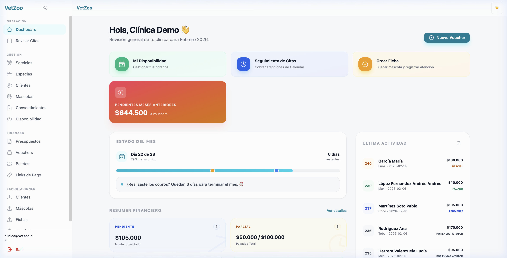

# ¡Hola! Soy Fran 👋

**Data Analytics · Full-Stack Development · Visual Analytics**

---

## 🎓 Sobre mí

Graduada en Ingeniería Informática y actualmente cursando el **Máster Universitario en Análisis y Visualización de Datos Masivos (Visual Analytics & Big Data)** en la [UNIR](https://www.unir.net/ingenieria/master-visual-analytics-big-data/).

Me apasiona transformar datos en decisiones y construir aplicaciones que realmente resuelvan problemas. Combino mi formación en análisis de datos con desarrollo full-stack para crear soluciones completas — desde el modelo de datos hasta la interfaz de usuario.

Cuando no estoy programando, probablemente estoy nadando 🏊‍♀️ o tomando café ☕.

## 🛠️ Tech Stack

**Lenguajes**

**Frontend**

**Backend & Data**

## 🚀 Proyecto destacado

### 🐾 VetZoo — CRM Veterinario

Plataforma integral de gestión para clínicas veterinarias, desarrollada con **React + TypeScript + Supabase**.

Gestión completa de clientes, mascotas, citas, fichas clínicas, recetas, presupuestos, facturación, notificaciones y más — todo en una interfaz moderna y responsiva.

<!-- Si quieres añadir una captura, descomenta la línea siguiente y sube la imagen a assets/screenshots/ -->
<!--  -->

**Tech:** React · TypeScript · Vite · Supabase · PostgreSQL

## 📂 Otros proyectos

| Proyecto | Descripción | Tech |
|----------|-------------|------|
| [Design Patterns](https://github.com/frana00/design-patterns) | Patrones de diseño con ejemplos prácticos | Java |
| **TFG — Perros Perdidos** ✅ | App móvil para reporte y búsqueda de perros extraviados | React Native · Expo |

## 📊 Áreas de interés

- 📈 Análisis y visualización de datos masivos
- 🤖 Machine Learning & Data Science
- 🌐 Desarrollo full-stack con enfoque en UX
- 🏥 Software para el sector salud y veterinario

## 📫 ¿Hablamos?

¿Tienes un proyecto interesante, una idea o simplemente quieres charlar sobre datos y tecnología?  
No dudes en contactarme.

---

Hecho con café y curiosidad ☕✨

